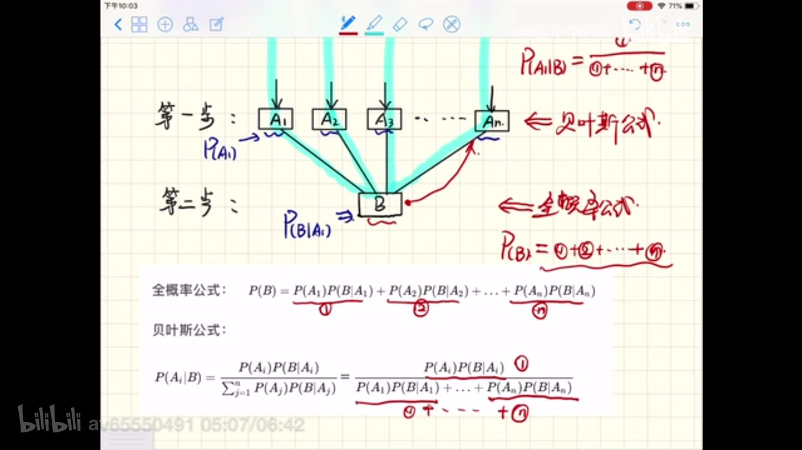
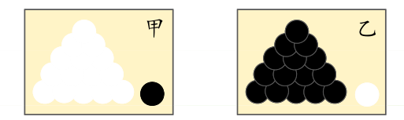
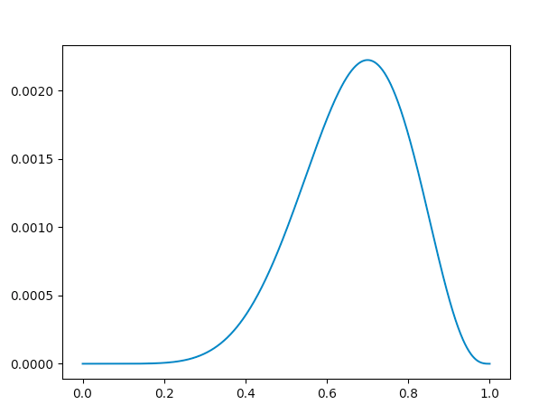
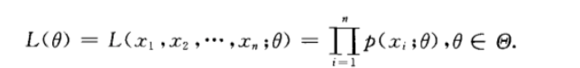
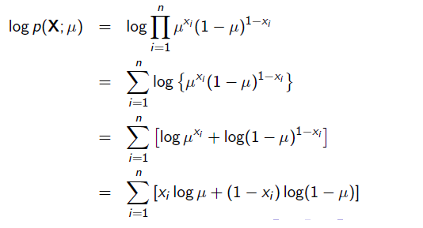
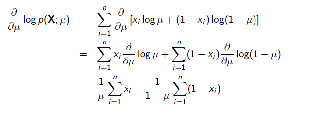
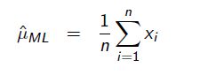

> 极大似然: https://www.toutiao.com/a6689304194777612813/
> https://www.zhihu.com/question/54082000/answer/470252492?hb_wx_block=1&utm_source=wechat_session&utm_medium=social&utm_oi=984539009145569280


### 一、概率论、数理统计
**数理统计:** 从观察值推出背后的数学模型（变量之间的关系），因为在真实世界里，我们只能通过观测值来预估数学模型，所以数理统计又是`后验`的。

**概率论:** 是演绎，从先验知识推出结论，在已知变量的概率分布下来推出各种结论,`先验`的。

#### 1、条件概率
让`A`和`B`为两个事件。那么`B`在`A`条件下的条件概率定义为：

$ P(B \mid A) = \frac{P(AB)}{P(A)}$

####2、全概率公式、贝叶斯公式


**贝叶斯公式应用:**
某个医院早上收了6个门诊病人,详细信息如下:
| 症状   | 职业     | 疾病   |
| ------ | -------- | ------ |
| 打喷嚏 | 护士     | 感冒   |
| 打喷嚏 | 农夫     | 过敏   |
| 头痛   | 建筑工人 | 脑震荡 |
| 头痛   | 建筑工人 | 感冒   |
| 打喷嚏 | 教师     | 感冒   |
| 头痛   | 教师     | 脑震荡 |

现在又来了一个病人,是一个打喷嚏的建筑工人,请问他患上感冒的概率有多大?

根据贝叶斯公式:
```py
P(A|B) = P(B|A)*P(A)/P(B)
```

可得:
```py
P(感冒|打喷嚏*建筑工人)
= P(打喷嚏*建筑工人|感冒) * P(感冒) / P(打喷嚏*建筑工人)
= P(打喷嚏|感冒)*P(建筑工人|感冒)*P(感冒)/P(打喷嚏)*P(建筑工人)
= 0.66*0.33*0.5/0.5*0.33
= 0.66
```

#### 2、随机变量
- 在古典概率模型中，“事件`硬币正面朝上`和事件的概率`1/2`是核心概念,
- 在现代概率论中，“随机变量`x=正面`及其取值规律`f(x)`是核心概念。
- 随机变量实际上只是事件的另一种表达方式，这种表达方式更加形式化和符号化，也更加便于理解以及进行逻辑运算。不同的事件，其实就是随机变量不同取值的组合。


#### 3、随机向量
略

#### 4、常见的离散型随机变量分布
1) 0-1分布/伯努利分布


2) 二项分布
二项分布就是重复n次独立的伯努利试验。如果独立重复抛n=10次硬币，正面朝上的次数k可能为0,1,2,3,4,5,6,7,8,9,10中的任何一个，那么k显然是一个随机变量，这里就称随机变量k服从二项分布。
n次抛硬币中恰好出现k次正面的概率为:
$$ P(X=k) = C(n,k) * pk*(1-p)n-k $$

#### 5、最大似然估计
**直观理解:**

甲乙两个箱子, 取出了一个球, 颜色是黑的,问:是从哪个箱子取出的? 更可能是乙,因为几率更大。最大似然就是最大概率。

**最大似然估计目:** 利用已知的样本结果，反推最有可能（最大概率）导致这样结果的参数值。

**举例:**
举一个抛硬币的简单例子。 现在有一个正反面不是很匀称的硬币，如果正面朝上记为H，方面朝上记为T，抛10次的结果如下：
```py
HHTTH, THHHH
```
求这个硬币正面朝上的概率有多大？

设正面朝上的概率为 $\theta$, 那么这个序列:
$$
L(\theta) = \theta * \theta * (1-\theta)*(1-\theta)*\theta*(1-\theta)*\theta*\theta*\theta*\theta
$$

$L(\theta) =\theta^7*(1-\theta)^3$

绘制这个函数:
```py
import matplotlib.pyplot as plt
import numpy as np

x =  np.linspace(0, 1, 1000)
def L(x):
  return x**7*(1-x)**3

y = L(x)
plt.plot(x,y)
plt.show()
```
函数图像结果为:

这个曲线就是θ的似然函数，通过了解在某一假设下，已知数据发生的可能性，来评价哪一个假设更接近θ的真实值。似然函数的最大值可能就是硬币朝上的概率。

设$x_1, x_2...x_n$是已知样本值,他们是常数。例如硬币例子正面朝上为1,反面朝上为0, 那么$x_1=1, x_3=0$。$L(\theta)$称为样本空间的似然函数,他是样本空间的联合联合分布律为:


两边取log,将连乘转化为连加:


想让似然函数最大(正面朝上的概率最大可能),求导数:


令导数为零:


这里就是:
$ u = 1/10 * (x_1+x_2+...x_n) = 0.2$

### 二、逻辑回归
分类函数(sigmoid):
$$sigmoid(z)=\frac{1}{1+e^{-z}} \quad p \in (0,1)$$

损失函数:
$$J(\theta)=-\sum_{i}^{m} Y log(\hat{Y}) - (1-Y) log(1-\hat{Y})$$

### 三、多分类
分类函数(softmax):


损失函数:
$$ J(\theta) = -\frac{1}{T}\sum_{i=1}^T \sum_{k=1}^K y_k^{(i)} \log(\hat{y}_k^{(i)}) $$
