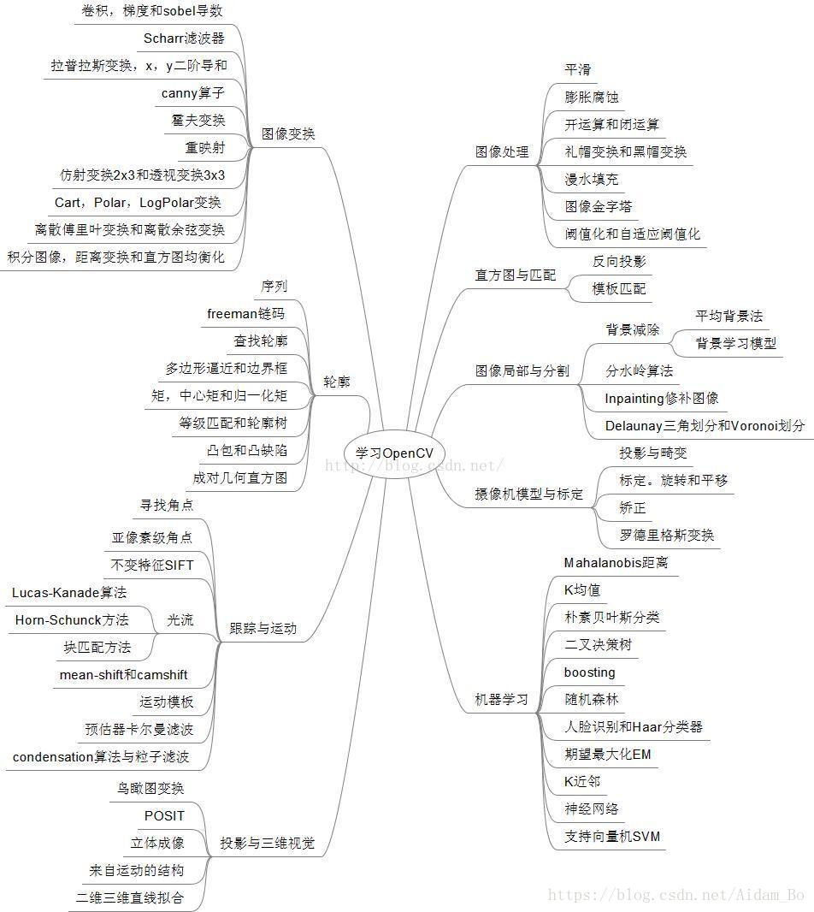

# 资料
代码：
https://github.com/spmallick/learnopencv

博客:
http://ex2tron.wang/
https://zhuanlan.zhihu.com/c_1094607699664277504
https://blog.csdn.net/aidam_bo/article/category/7820763
http://zhaoxuhui.top/tags/#ComputerVision

# 路线
参考结构:

## 第一部分
### 一、准备
* [x] 图像读写

### 二、图像处理(imgproc组件)
#### 1、线性滤波: 方框滤波、均值滤波、高斯滤波
* [x] 平滑处理
* [x] 灰度转换
* [ ] 均值滤波
* [ ] 高斯滤波

#### 2、非线性滤波：中值滤波、双边滤波
* [ ] 中值滤波
* [ ] 双边滤波

#### 3、形态学滤波
* [x] 腐蚀
* [ ] 膨胀
* [ ] 开运算
* [ ] 闭运算
* [ ] 闭形态学梯度
* [ ] 顶帽
* [ ] 黑帽

#### 4、漫水填充
* [ ] 漫水填充算法

#### 5、图像金字塔与尺寸缩放
* [ ] 尺寸调整
* [ ] 图像金字塔

#### 6、阈值化
* [ ] 固定阈值
* [ ] 自适应阈值

### 三、图像变换(imgproc组件)
#### 1、基于OpenCV的边缘检测
* [ ] Canny算子
* [ ] Sobel算子

#### 2、霍夫变换
* [ ] 直线检测
* [ ] 圆检测

#### 3、重映射
* [ ] remap

#### 4、仿射变换

轮廓
- 内存
- 序列
- 查找轮廓
- Freeman链码
- 多边形逼近和边界框
- 凸包和凸缺陷
- 矩/中心矩/归一化矩

图像局部与分割
- 局部与分割
- 背景减除
- 分水岭法

跟踪与运动
- 跟踪基础
- 寻找角点
- 亚像素角点
- 不变特征
- 光流

<全文结束>

### 四、图像轮廓(imgproc组件)
#### 1、查找并绘制轮廓
#### 2、寻找凸包
#### 3、图像的矩
#### 4、分水岭法

### 五、直方图与匹配(imgproc组件)
* [ ] 直方图的基本数据结构
* [ ] 访问直方图
* [ ] 均衡化
* [ ] 直方图的基本策略
* [ ] 一些更复杂的策略
* [ ] 模板匹配
* [ ] 反向投影

## 第二部分
### 一、角点检测
### 二、特征检测与匹配
<全文结束>

# 应用
- 游戏外挂(跳一跳)
- OCR(身份证识别)
- 图像修复(Image Inpainting)

# 尾巴
