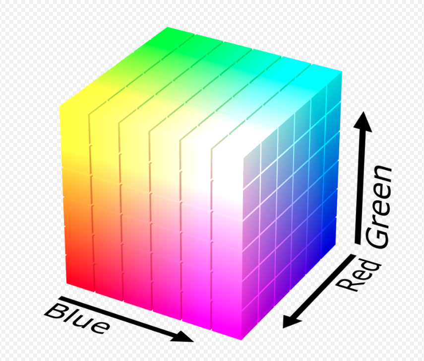
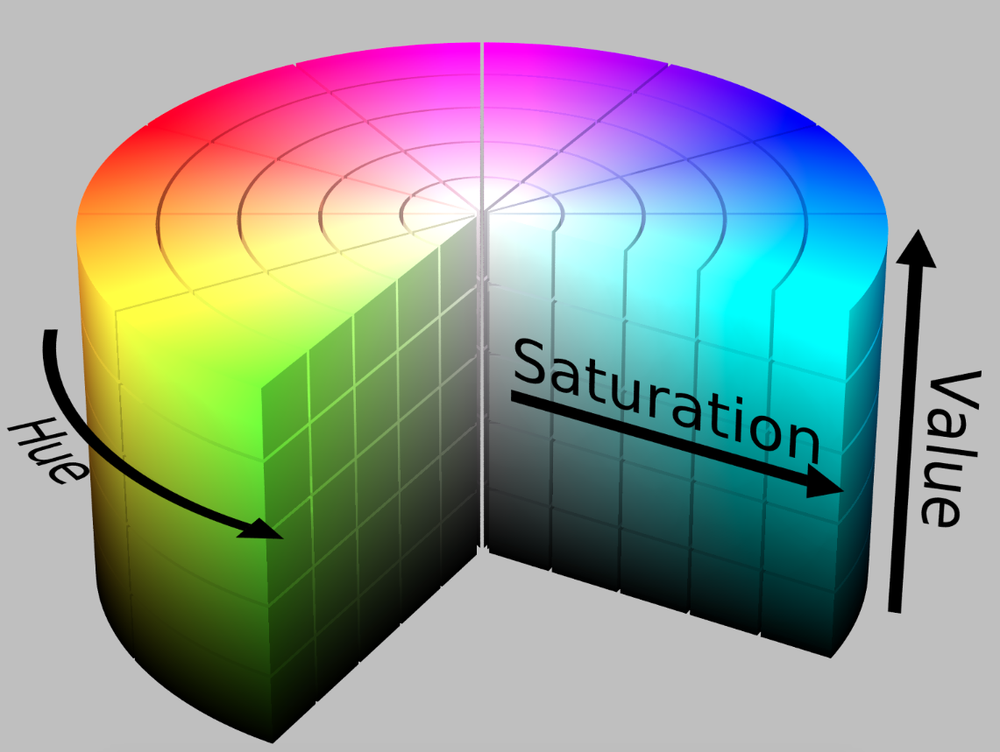

> v0.0.1 2019/9/14 DSLMing
> 首次创作
>
> 感谢:
> http://ex2tron.wang/opencv-python-introduction-and-installation/

#### 1、安装环境
首先安装python, 然后安装依赖,本教程编写时使用的软件版本是：OpenCV 4.x，Python 3.x。
```
pip3 install opencv-python
pip3 install numpy
```

#### 2、编码规范
最常用的依赖引入方式为:
```python
# -*- coding: utf-8 -*-
import cv2 as cv
import numpy as np
```

命名规范:
```python
# 函数/方法: 小驼峰
findTransform()
# 变量: 下划线连接小写字母
binary_image = cv.imread("./test.png")
```

#### 3、背景知识
**常用的图片格式:**
|格式|全称|压缩方式|
|-|-|-|
|bmp|Bitmap|不压缩|
|jpg|Joint Photographic Experts Group|有损压缩|
|png|Portable Network Graphics|无损压缩|

**颜色空间:**
- RGB:
通过红绿蓝三原色来描述颜色的颜色空间，R=Red、G=Green、B=Blue。模型如下:


- HSV:
使用色调(Hue)、饱和度(Saturation)、明度(Value)来描述颜色的颜色空间。模型如下:

HSV是一个常用于颜色识别的模型，相比BGR更易区分颜色。
> 经验之谈：OpenCV中色调H范围为[0,179]，饱和度S是[0,255]，明度V是[0,255]。虽然H的理论数值是0°~360°，但8位图像像素点的最大值是255，所以OpenCV中除以了2，某些软件可能使用不同的尺度表示，所以同其他软件混用时，记得归一化。

从BGR转换到HSV:
```python
hsv = cv2.cvtColor(img, cv2.COLOR_BGR2HSV)
```

#### 3、图片的读写
读:
```python
# filename: 文件名
# flags:
# - cv.IMREAD_COLOR：彩色图，默认值(1)
# - cv.IMREAD_GRAYSCALE：灰度图(0)
# - cv.IMREAD_UNCHANGED：包含透明通道的彩色图(-1)
cv.imread(filename, flags)
```
`Tip: 在读取图像时，返回的是Numpy的数组。而Numpy是经过优化的进行快速矩阵运算的软件包。 所以不推荐逐个获取像素并修改，这样可能会很慢，能用矩阵运算就不要用循环。 例如对图像的每个像素的像素值加1。可以直接用矩阵运算操作，而不需要再自己写循环遍历.`

显示:
```python
# winname: 窗口名
# mat: 图片数据
cv.imshow(winname, mat)
cv.waitKey(0)
```
但是程序显示一闪而过,需要停留下来,所以:
```python
# 等待, 0表示一直等
cv2.waitKey(0)
# 销毁所有的窗口
cv2.destroyAllWindows()
```
保存:
```python
cv2.imwrite(filename, img)
```

#### 4、图片属性
img.shape获取图像的形状，图片是彩色的话，返回一个包含行数(高度)、列数(宽度)和通道数的元组，灰度图只返回行数和列数：
```python
# img 是彩色图
height, width, channels = img.shape
# img是灰度图
height, width = img.shape
```

#### 5、获取和修改像素点值
通过行列的坐标来获取某像素点的值，对于彩色图，结果是B,G,R三个值的列表，对于灰度图或单通道图，只有一个值：
```python
# 彩色,第100行,90列的像素值
px = img[100, 90]
print(px)  # [103 98 197], BGR
# blue通道
px_blue = img[100, 90, 0]
print(px_blue)  # 103
```

修改像素值,img[y, x]:
```python
img[100, 90] = [255, 255, 255]
print(img[100, 90])  # [255 255 255]
```

#### 6、性能评估
评估代码运行时间:
```python
import cv2 as cv
start = cv.getTickCount()
# 这里写测试代码...
count = 0.1
for i in range(1000):
    count = count * 0.9
end = cv.getTickCount()
print((end - start) / cv.getTickFrequency(), 's')
```

优化原则:
- 尽量避免使用循环，尤其嵌套循环，因为极其慢！！！
- 优先使用OpenCV/Numpy中封装好的函数
- 尽量将数据向量化，变成Numpy的数据格式
- 尽量避免数组的复制操作

#### 7、通道分割与合并
彩色图的BGR三个通道是可以分开单独访问的，也可以将单独的三个通道合并成一副图像。分别使用cv2.split()和cv2.merge()：
```python
b, g, r = cv2.split(img)
img = cv2.merge((b, g, r))
```

split()函数比较耗时，更高效的方式是用numpy中的索引，如提取B通道:
```python
b = img[:, :, 0]
cv2.imshow('blue', b)
cv2.waitKey(0)
```

> 全文结束
