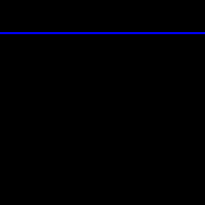
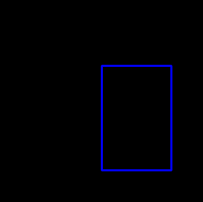
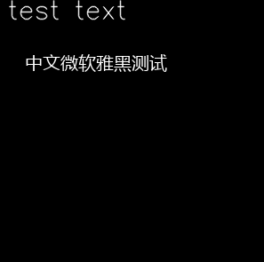
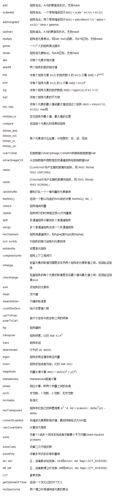

> v0.0.1 2019/9/14 DSLMing
> 首次创作
>
> 感谢:
> http://ex2tron.wang/opencv-python-introduction-and-installation/
> https://zhaoxuhui.top//blog/2017/05/04/%E5%9F%BA%E4%BA%8EPython%E7%9A%84OpenCV%E5%9B%BE%E5%83%8F%E5%A4%84%E7%90%862.html
> https://blog.gtwang.org/programming/opencv-drawing-functions-tutorial/

#### 1、绘图
**线:**
注意点的坐标为:(x,y),也就是(col, row),列在前,行在后。
```python
img = np.zeros((300, 300, 3), np.uint8)
# 50行水平画一条线
cv2.line(img, (0, 50), (300, 50), (255, 0, 0), 2)
```


**矩形:**
```python
cv2.rectangle(img, (150, 100), (250, 250), (255, 0, 0), 2)
cv2.imshow("dist", img)
```


**圆:**
```python
draw = np.zeros((300, 300, 3), np.uint8)
# -1代表实心圆
cv2.circle(draw, (150, 150), 70, (100, 100, 200), -1)
cv2.imshow("draw", draw)
```


**多边形:**
根据坐标点用直线填充。
```python
points = np.array([[(0, rows), (460, 325), (520, 325), (520, 960)]])
cv2.fillPoly(img, points, 255)
```

**文字:**
```python
cv2.putText(img, "test text", (10, 25), cv2.FONT_HERSHEY_SIMPLEX, 1, (255, 255, 255), 1, cv2.LINE_AA)
text = "中文微软雅黑测试"
fontPath = "./msyh.ttf"
font = ImageFont.truetype(fontPath, 20)
imgPil = Image.fromarray(img)
draw = ImageDraw.Draw(imgPil)
draw.text((30, 60), text, font=font, fill=(255, 255, 255))
img = np.array(imgPil)
cv2.imshow('My Image', img)
```



#### 2、常用运算


