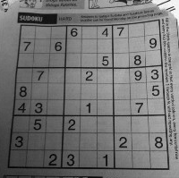
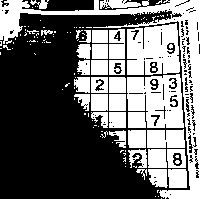

> v0.0.1 2019/9/14 DSLMing
> 首次创作
>
> 感谢:
> http://ex2tron.wang/opencv-python-image-thresholding/
>https://zhaoxuhui.top//blog/2017/05/17/%E5%9F%BA%E4%BA%8EPython%E7%9A%84OpenCV%E5%9B%BE%E5%83%8F%E5%A4%84%E7%90%866.html

重点:
- 阈值图像的输入是灰度图像
- 阈值图像的输出是二值图像


#### 1、阈值
原始图:

**固定阈值:**
```python
# 第一个值: 必须是灰度图
# 第二个值: 阈值
# 第三个值: 像素值高于/小于阈值时被赋予的值
# 第四个值: 阈值方法
# 返回的第一个值: 阈值
# 返回的第二个值是二值图
ret, thresh1 = cv2.threshold(gray, 128, 255, cv2.THRESH_BINARY)
或者:
ret = cv2.threshold(gray, 128, 255, cv2.THRESH_BINARY)[0]
thresh1 = cv2.threshold(gray, 128, 255, cv2.THRESH_BINARY)[1]
> 这里使用python 语法糖-序列解包
```


**自适应阈值:**
```python
# 参数1：要处理的原图
# 参数2：最大阈值，一般为255
# 参数3：小区域阈值的计算方式
#      ADAPTIVE_THRESH_MEAN_C：小区域内取均值
#      ADAPTIVE_THRESH_GAUSSIAN_C：小区域内加权求和，权重是个高斯核
# 参数4：阈值方式（跟前面讲的那5种相同）
# 参数5：小区域的面积，如11就是11*11的小块
# 参数6：最终阈值等于小区域计算出的阈值再减去此值
th = cv2.adaptiveThreshold(gray, 255, cv2.ADAPTIVE_THRESH_GAUSSIAN_C, cv2.THRESH_BINARY, 17, 6)
```


**Otsu阈值:**
在前面固定阈值中，我们是随便选了一个阈值如127，那如何知道我们选的这个阈值效果好不好呢？答案是：不断尝试，所以这种方法在很多文献中都被称为经验阈值。Otsu阈值法就提供了一种自动高效的二值化方法，不过我们直方图还没学，这里暂时略过。

#### 2、平滑
图像滤波可以对目标图像的噪声进行抑制,这个过程叫做图像的滤波操作。主要用来减少图像的噪点或失真。
- 按频率分类
  - 低通：模糊/平滑
  - 高通：锐化

- 按线性分类
a.线性滤波:
  - 方框滤波
  - 均值滤波
  - 高斯滤波

b.非线性滤波：
  - 中值滤波
  - 双边滤波

**模糊:**
```python
# 平均模糊
dst = cv2.blur(img, (5, 5))
# 高斯模糊
dst = cv2.GaussianBlur(img, (65, 65), 0)
# 中值模糊
dst = cv2.medianBlur(img, 9)
# 双边滤波
dist = cv2.bilateralFilter(img, 9, 75, 75)
```

#### 3、噪声
详细参考: https://zhaoxuhui.top//blog/2017/05/17/%E5%9F%BA%E4%BA%8EPython%E7%9A%84OpenCV%E5%9B%BE%E5%83%8F%E5%A4%84%E7%90%866.html#%E5%9B%BE%E5%83%8F%E5%99%AA%E5%A3%B0
