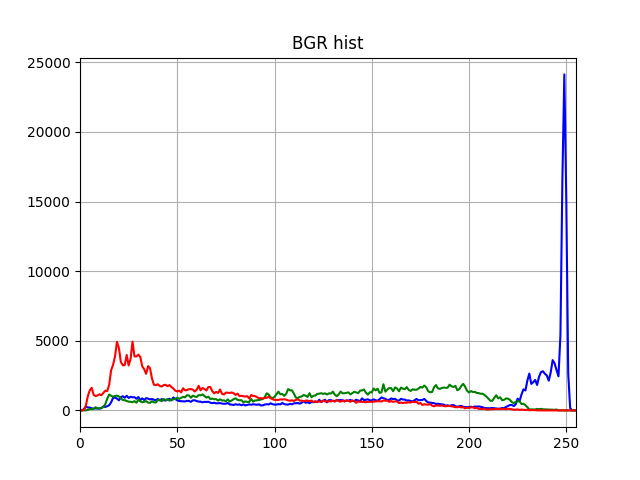
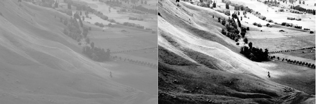
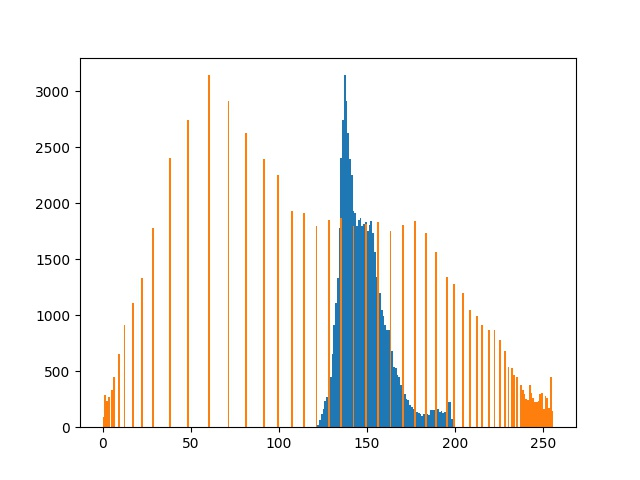
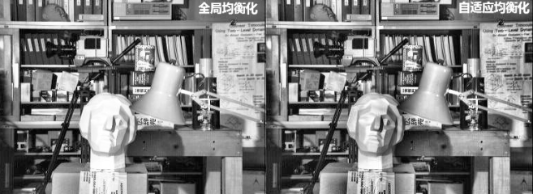

### 直方图
直方图简单来说就是图像中每个像素值的个数统计，比如说一副灰度图中像素值为0的有多少个，1的有多少个……直方图是一种分析图片的手段:


#### 1、绘制直方图
在计算直方图之前，有几个术语先来了解一下：
- dims：要计算的通道数，对于灰度图dims=1，普通彩色图dims=3
- range：要计算的像素值范围，一般为[0,256)
- bins：子区段数目，如果我们统计0~255每个像素值，bins=256；如果划分区间，比如0~15, 16~31…240~255这样16个区间，bins=16

**不使用掩模:**
```python
img = cv2.imread('sea.jpg')
# img = cv2.GaussianBlur(img, (65, 65), 3)
img = cv2.medianBlur(img, 9)
# 新建一个元组，分别对应不同通道的颜色以供遍历
color = ('b', 'g', 'r')
# 对于一个列表或数组，既要遍历索引又要遍历元素时
# 使用内置enumerate函数会更加直接、优美
# 它会将数组或列表组成一个索引序列
# 使我们再获取索引和索引内容的时候更加方便
plt.title('BGR hist')
for i, col in enumerate(color):
    histr = cv2.calcHist([img], [i], None, [256], [0, 255])
    plt.plot(histr, color=col)
    plt.xlim([0, 255])
plt.grid(True)
# plt.show()
plt.savefig("../doc/hist_cal.png")
```


**使用掩模:**
```python
# 读取图片
img = cv2.imread("E:\\522.jpg", 0)
# 新建一个与原图等大的空白图片(黑色)
mask = np.zeros(img.shape[:2], np.uint8)
# 将图片中200×200范围的像素设为255(白色)
mask[100:300, 300:500] = 255
# 将掩膜与原图进行位操作
masked_img = cv2.bitwise_and(img, img, mask=mask)
# 这时传入的参数不再是None，而是mask了
hist_mask = cv2.calcHist([img], [0], mask, [256], [0, 255])
```


#### 2、直方图均衡化
均衡前后图片对比:


均衡前后直方图对比:


```python
img = cv2.imread('hist.png', 0)
equ = cv2.equalizeHist(img)
cv2.imwrite('../doc/equalization_befor_pic.jpg', np.hstack((img, equ)))  # 并排显示
plt.hist(img.ravel(), 256, [0, 256])
plt.hist(equ.ravel(), 256, [0, 256])
plt.savefig("../doc/equalization_befor_hist.jpg")
```

#### 3、自适应均衡化
不难看出来，直方图均衡化是应用于整幅图片的，会有什么问题呢？局部失真！
自适应均衡化就是用来解决这一问题的：它在每一个小区域内（默认8×8）进行直方图均衡化。当然，如果有噪点的话，噪点会被放大，需要对小区域内的对比度进行了限制，所以这个算法全称叫：对比度受限的自适应直方图均衡化CLAHE(Contrast Limited Adaptive Histogram Equalization)。

```python
# 自适应均衡化，参数可选
clahe = cv2.createCLAHE(clipLimit=2.0, tileGridSize=(8, 8))
cl1 = clahe.apply(img)
```



> 全文结束
